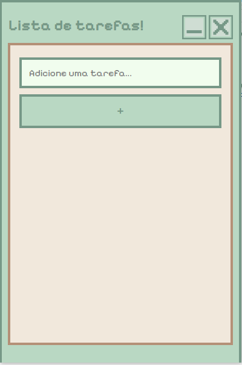

## Lista de Tarefas!

Aplicativo simples de lista de tarefas feito com HTML, CSS, JavaScript e Electron.
Permite adicionar, marcar como concluídas e excluir tarefas, tudo fica salvo localmente no seu computador.
Desenvolvido para rodar como **app de desktop** (Windows).

## Como usar =
- Digite uma tarefa no campo de texto;
- Clique no botão `+` para adicionar;
- Clique na tarefa para marcar como concluída;
- Clique no `×` para remover.

## 🖥️ Download

Baixe o instalador do app aqui:  
👉 [Download para Windows (.exe)](https://github.com/paula-souza-morais/app-lista-de-tarefas/releases/tag/v.1.0.0)

## Como foi feito =

**Tecnologias usadas:**
- HTML5;
- CSS3;
- JavaScript;  
- Electron (para transformar em aplicativo desktop);

## Lições aprendidas =

Aprendi como o Electron conecta o front-end com o Node.js pra criar apps desktop reais.  
Também entendi melhor como manipular janelas, criar botões customizados e empacotar projetos pra distribuição.

## Preview =

